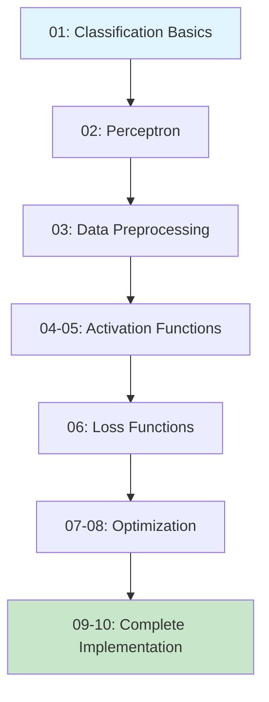

<div align="center">
  <table>
    <tr>
      <td align="center" width="33%">
        
      </td>
      <td align="center" width="33%">
        <h1 style="font-size: 72px; margin: 0;">🎓</h1>
      </td>
      <td align="center" width="33%">

      </td>
    </tr>
  </table>

  <h1>Machine Learning: Teach by Doing</h1>
  
  <p><strong>Educational Series by <a href="https://vizuara.ai">Vizuara</a></strong></p>
  
  <p><em>Hands-on tutorials for understanding fundamental machine learning algorithms through interactive visualizations</em></p>

</div>

<div align="center">

[](https://www.youtube.com/playlist?list=PLPTV0NXA_ZSi-nLQ4XV2Mds8Z7bihK68L)
[](https://www.python.org/downloads/)
[](https://jupyter.org/)
[](https://github.com/VizuaraAI/Machine-Learning-Teach-by-Doing/blob/main/LICENSE)
[](https://github.com/VizuaraAI/Machine-Learning-Teach-by-Doing)

</div>

---

## What You'll Learn

This repository contains **10 comprehensive Jupyter notebooks** that take you from basic classification to advanced optimization techniques:

- **Classification Algorithms** - Perceptron, Linear Classifiers, Logistic Regression
- **Data Preprocessing** - One-Hot Encoding, Feature Engineering
- **Activation Functions** - Sigmoid visualizations in 2D and 3D
- **Loss Functions** - Cross-Entropy Loss deep dive
- **Optimization** - Gradient Descent in 1D and 2D
- **Regularization** - Preventing overfitting with L2 regularization

### YouTube Series

Follow along with our complete video tutorial series:

**[Watch on YouTube →](https://www.youtube.com/playlist?list=PLPTV0NXA_ZSi-nLQ4XV2Mds8Z7bihK68L)**

## Complete Curriculum

<table>
  <tr>
    <th width="5%">#</th>
    <th width="35%">Notebook</th>
    <th width="60%">What You'll Build</th>
  </tr>
  <tr>
    <td align="center">01</td>
    <td><strong><a href="01_Random_Linear_Classification.ipynb">Random Linear Classification</a></strong><br/><em>Binary Classification Basics</em></td>
    <td>
      • Dogs vs Cats classifier from scratch<br/>
      • K-fold cross-validation<br/>
      • Decision boundary visualization<br/>
      • Train/test split evaluation
    </td>
  </tr>
  <tr>
    <td align="center">02</td>
    <td><strong><a href="02_Perceptron.ipynb">Perceptron Algorithm</a></strong><br/><em>The Building Block</em></td>
    <td>
      • Classic perceptron from scratch<br/>
      • Iterative learning process<br/>
      • Linear separability concepts<br/>
      • Real-time boundary updates
    </td>
  </tr>
  <tr>
    <td align="center">03</td>
    <td><strong><a href="03_One_Hot_encoding.ipynb">One-Hot Encoding</a></strong><br/><em>Data Preprocessing</em></td>
    <td>
      • Transform categorical data<br/>
      • scikit-learn OneHotEncoder<br/>
      • Employee dataset example<br/>
      • Prepare data for ML pipelines
    </td>
  </tr>
  <tr>
    <td align="center">04</td>
    <td><strong><a href="04_Sigmoid_Visual_2d.ipynb">Sigmoid Visualization (2D)</a></strong><br/><em>Activation Functions</em></td>
    <td>
      • Understand sigmoid curves<br/>
      • Parameter effects (θ, θ₀)<br/>
      • Decision threshold intuition<br/>
      • Foundation for logistic regression
    </td>
  </tr>
  <tr>
    <td align="center">05</td>
    <td><strong><a href="05_Sigmoid_Visual_3d.ipynb">Sigmoid Visualization (3D)</a></strong><br/><em>Interactive 3D Plots</em></td>
    <td>
      • 3D surface plots with Plotly<br/>
      • Decision surfaces in 3D<br/>
      • Interactive exploration<br/>
      • Multi-dimensional intuition
    </td>
  </tr>
  <tr>
    <td align="center">06</td>
    <td><strong><a href="06_CrossEntropyLoss.ipynb">Cross-Entropy Loss</a></strong><br/><em>Loss Functions</em></td>
    <td>
      • Loss function mechanics<br/>
      • Parameter impact analysis<br/>
      • Prediction visualization<br/>
      • Optimization foundations
    </td>
  </tr>
  <tr>
    <td align="center">07</td>
    <td><strong><a href="07_Gradient_Descent_ 1D.ipynb">Gradient Descent (1D)</a></strong><br/><em>Optimization Basics</em></td>
    <td>
      • Minimize quadratic functions<br/>
      • Step-by-step gradient updates<br/>
      • Learning rate exploration<br/>
      • Convergence visualization
    </td>
  </tr>
  <tr>
    <td align="center">08</td>
    <td><strong><a href="08_Gradient_Descent_2D.ipynb">Gradient Descent (2D)</a></strong><br/><em>Multi-Dimensional Optimization</em></td>
    <td>
      • 3D surface optimization<br/>
      • Multi-variable gradients<br/>
      • Interactive descent paths<br/>
      • Higher-dimensional concepts
    </td>
  </tr>
  <tr>
    <td align="center">09</td>
    <td><strong><a href="09_Logistic_Regression_2D.ipynb">Logistic Regression (2D)</a></strong><br/><em>Complete Implementation</em></td>
    <td>
      • Logistic regression from scratch<br/>
      • Gradient-based training<br/>
      • Boundary evolution tracking<br/>
      • Loss monitoring
    </td>
  </tr>
  <tr>
    <td align="center">10</td>
    <td><strong><a href="10_Logistic_Regression_Regularization.ipynb">Regularization Techniques</a></strong><br/><em>Advanced Concepts</em></td>
    <td>
      • L2 regularization (Ridge)<br/>
      • Polynomial feature expansion<br/>
      • Overfitting prevention<br/>
      • Complex decision boundaries<br/>
      <em>Dataset: <a href="logistic_regression_data.csv">logistic_regression_data.csv</a></em>
    </td>
  </tr>
</table>

---

## Quick Start Guide

### Step 1: Clone & Install

```bash
# Clone the repository
git clone https://github.com/VizuaraAI/Machine-Learning-Teach-by-Doing.git
cd Machine-Learning-Teach-by-Doing

# Install dependencies
pip install -r requirements.txt
```

### Step 2: Launch Jupyter

```bash
jupyter notebook
```

### Step 3: Start Learning!

Open [01_Random_Linear_Classification.ipynb](01_Random_Linear_Classification.ipynb) and begin your ML journey!

---

## Prerequisites & Dependencies

<div align="center">

| Requirement | Version | Purpose |
|------------|---------|---------|
| **Python** | 3.7+ | Core language |
| **Jupyter** | Latest | Interactive notebooks |
| **NumPy** | Latest | Numerical computing |
| **Matplotlib** | Latest | 2D plotting |
| **Plotly** | Latest | 3D interactive plots |
| **scikit-learn** | Latest | ML utilities |
| **SciPy** | Latest | Scientific computing |
| **Seaborn** | Latest | Statistical visualization |
| **Pandas** | Latest | Data manipulation |

</div>

### Installation

Create a `requirements.txt` file:

```txt
numpy
matplotlib
plotly
scikit-learn
scipy
seaborn
pandas
jupyter
```

Then install:

```bash
pip install -r requirements.txt
```

---

## Dataset Information

- **logistic_regression_data.csv** - Used in Notebook 10 for demonstrating regularization techniques with complex decision boundaries

---

## Recommended Learning Path

<div align="center">



</div>

**Suggested Approach:**

1. **Foundations (Notebooks 1-3)** - Understand classification and data preparation
2. **Activation & Loss (Notebooks 4-6)** - Learn the mathematics behind ML
3. **Optimization (Notebooks 7-8)** - Master gradient descent
4. **Advanced (Notebooks 9-10)** - Build complete ML systems

---

## What Makes This Series Special?

<table>
  <tr>
    <td align="center" width="25%">
      <h3>Visual Learning</h3>
      <p>Every concept explained with interactive plots and animations</p>
    </td>
    <td align="center" width="25%">
      <h3>From Scratch</h3>
      <p>Implement algorithms without black-box libraries</p>
    </td>
    <td align="center" width="25%">
      <h3>Video Support</h3>
      <p>Watch detailed explanations on YouTube</p>
    </td>
    <td align="center" width="25%">
      <h3>Real Examples</h3>
      <p>Practical applications with real datasets</p>
    </td>
  </tr>
</table>

---

## Community & Support

<div align="center">

### Having Issues?

Check our [YouTube playlist](https://www.youtube.com/playlist?list=PLPTV0NXA_ZSi-nLQ4XV2Mds8Z7bihK68L) for detailed walkthroughs

Found a bug? [Open an issue](../../issues)

Want to contribute? Pull requests are welcome!

</div>

---

## License

This project is licensed under the MIT License - see the [LICENSE](https://github.com/VizuaraAI/Machine-Learning-Teach-by-Doing/blob/main/LICENSE) file for details.

Free to use for educational and commercial purposes.

---

## Acknowledgments

Created with passion for teaching machine learning concepts in an accessible, hands-on way. Special thanks to the open-source community for the amazing tools that made this possible.

---

<div align="center">
  
  <h3>Made with ❤️ by <a href="https://vizuara.ai">Vizuara</a></h3>
  
  <p>
    <a href="https://www.youtube.com/playlist?list=PLPTV0NXA_ZSi-nLQ4XV2Mds8Z7bihK68L">YouTube</a> •
    <a href="https://vizuara.ai">Website</a> •
    <a href="https://github.com/VizuaraAI/Machine-Learning-Teach-by-Doing">GitHub</a> •
    <a href="https://github.com/VizuaraAI/Machine-Learning-Teach-by-Doing/issues">Report Bug</a> •
    <a href="https://github.com/VizuaraAI/Machine-Learning-Teach-by-Doing/issues">Request Feature</a>
  </p>
  
  <p><em>Star this repository if you find it helpful!</em></p>

</div>
